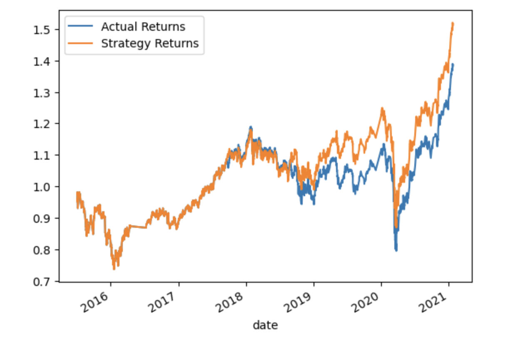
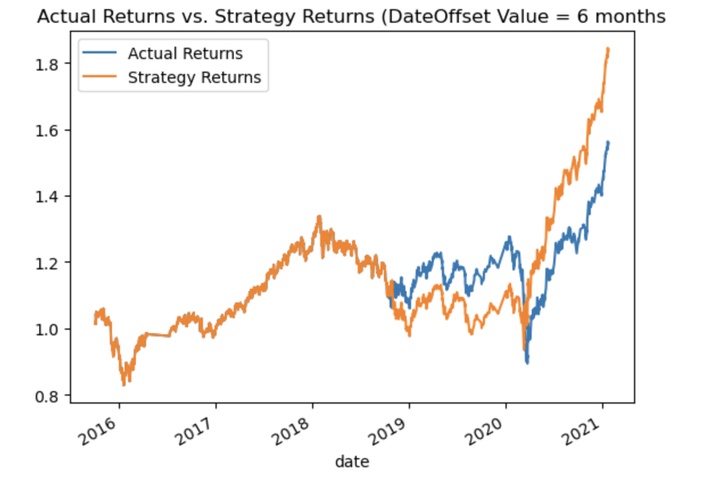
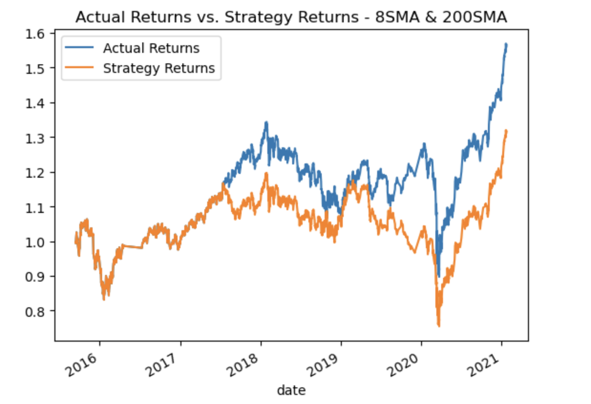
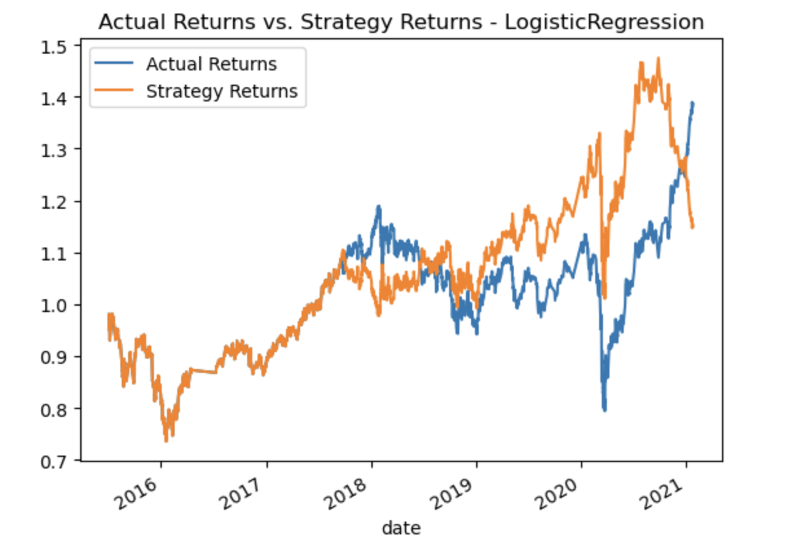

# Module14

### Save a PNG image of the cumulative return plot that shows the actual returns vs. the strategy returns

Based on the above image showing the actual returns versus the strategy returns, the strategy has produced better results than the actual MSCI-based emerging markets ETF. From mid-2018 onwards, the strategy has consistently produced better returns regardless of market environment. During the COVID crash in early 2020, the ETF and the algorithm saw a downturn but the algorithm saw a less severe downturn. In the run up following the March 2020 lows, the algorithm clearly outperformed the ETF.

Note that this serves as a baseline against which to compare the effects of tuning the trading algorithm. 

## Tune the Baseline Trading Algorithm

### Tune the training algorithm by adjusting the size of the training dataset. Use a different 'DateOffset' value (6 months)

#### What impact resulted from increasing or decreasing the training window?

The algorithm's baseline performance was based off a DateOffset value of 3 months. We adjusted the size of the training dataset by using a different DateOffset value. Instead of it being 3 months, we changed it to 6 months. Based on the plot, the algorithm underperformed compared to the ETF until the crash in early 2020. The algorithm suffered a less severe blow than the actual ETF and went onto overperform after the market bottomed out in March of 2020. 

### Tune the trading algorithm by adjusting the SMA input features. 

#### What impact resulted from increasing or decreasing either or both of the SMA windows?

The algorithm's baseline performance was based off 2 SMA input features where the short-window was 4 and the long-window was 100. We adjusted the short-window to 8 and the long-window to 200. The DateOffset value was reset back to the original 3 months. Based on the plot, the algorithm consistently underperformed the ETF. It wasn't close at all. While the general trend of the algorithm follows that of the ETF, the gains are clearly under that of the ETF.

### Choose the set of parameters that best improved the trading algorithm returns.

The set of parameters that produce the best returns for the trading algorithm is the original parameters where the DateOffset value is 3 months and the short and long windows for the SMAs are 4 and 100, respectively. The other two sets of parameters produce decent results but it's clear the original set of parameters produce superior returns.

## Evaluate a New Machine Learning Classifier

### Backtest the new model to evaluate its performance. Save a PNG image of the cumulative product of the actual returns vs. the strategy returns for this updated trading algorithm. 

#### Did this new model perform better or worse than the provided baseline model? Did this new model perform better or worse than your tuned trading algorithm?

This new model appears to have performed better than the baseline model from mid-2018 to mid-2020; however, the new model appears to have come down in late 2020 despite the market continuing to rally here. I would say that this new model performed worse than the provided baseline model. The new model performs worse than the tuned trading algorithms. 

## Create an Evaluation Report

### Express your final conclusions and analysis.

Overall, based on the plots, it would appear that the baseline model produced the best and most consistent results. The baseline model consistently produced returns that exceeded the market and held up better during the COVID downturn in early 2020. 

The algorithm with the DateOffset value set at 6 months rather than 3 months produced signficiantly better returns compared to the ETf itself after the COVID-induced crash but trailed the ETF's performance in 2019. 

The algorithm with the adjusted SMA input features for the short and long window set at 8 and 200, respectively consistently underperformed the ETF's returns. 

The new model created using the LogisticRegression classifier produced stellar returns from mid-2018 to mid-2020 but took an unexpected and uncorrelated downturn in late 2020. This needs to be further investigated as it just completely went against ETF's general uptrend. This unexpected turn and inconsistency should make any investor hesitant. The fact that the ETF itself was trending higher while the algorithm lost money is cause for great concern. 

Of all the various models produced, the baseline model is the clear winner and should be deployed live going forward. 
